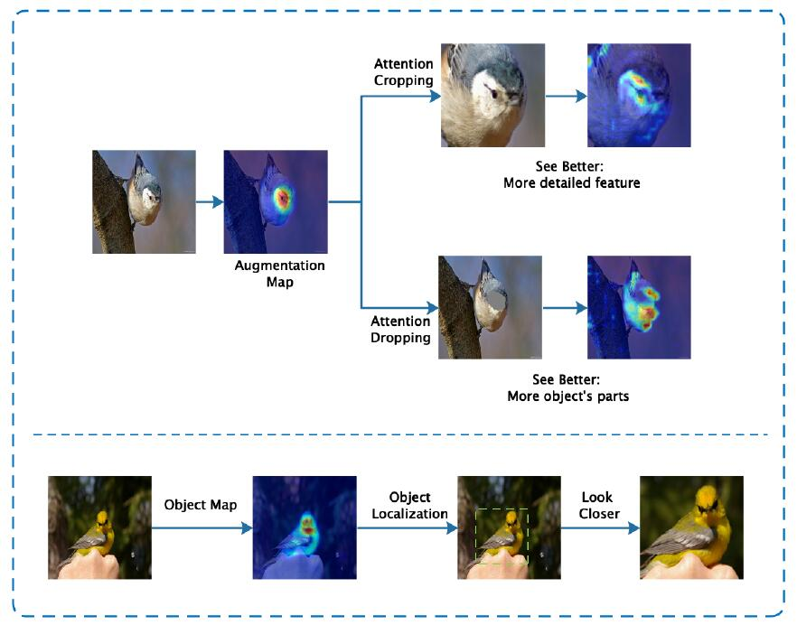
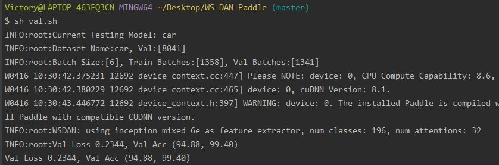
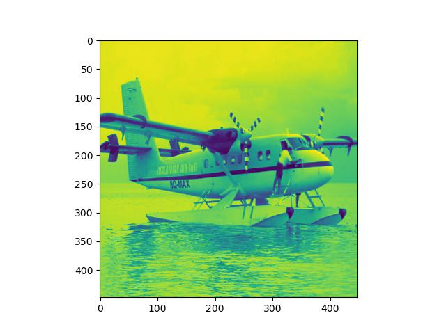
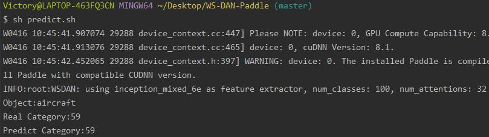

# WS-DAN-Paddle
## 目录

- [1. 简介](#1)
- [2. 数据集和复现精度](#2)
- [3. 准备数据与环境](#3)
  
    - [3.1 准备环境](#31)
    - [3.2 准备数据](#32)
    - [3.3 准备模型](#33)
- [4. 代码结构说明](#4)
- [5. 开始使用](#5)
  
    - [5.1 模型训练](#51)
    - [5.2 模型预测](#52)
    - [5.3 单张图片预测](#52)
- [6. LICENSE](#6)
- [7. 参考链接与文献](#7)

<a name="1"></a>

## 1. 简介
对于细粒度分类问题，一般的网络不能取得准确率较高的结果，而论文《 [See Better Before Looking Closer: Weakly Supervised Data Augmentation Network for Fine-Grained Visual Classification](https://arxiv.org/abs/1901.09891)》提出基于弱监督的数据增强网络，作者提出了基于注意力的双线性池化（BAP）、注意力正则化（AP）、注意力引导数据增强（Drop和Crop）、最后预测阶段进行目标定位与图像精修（Refinement），本Repo为基于Paddle2.2框架的复现。

<div align="center">
    
</div>

**论文:** [See Better Before Looking Closer: Weakly Supervised Data Augmentation Network for Fine-Grained Visual Classification](https://arxiv.org/pdf/1901.09891.pdf)

**参考repo:** [https://github.com/wvinzh/WS_DAN_PyTorch](https://github.com/wvinzh/WS_DAN_PyTorch)

在此非常感谢`wvinzh`等人贡献的[WS_DAN_PyTorch](https://github.com/wvinzh/WS_DAN_PyTorch)，提高了本repo复现论文的效率。

**AI Studio体验教程:** [运行一下](https://aistudio.baidu.com/aistudio/projectdetail/3809770?contributionType=1&shared=1) （已挂载相关数据集，省去修改路径步骤，模型测试、训练直接运行！）

**Github复现地址:** [点击查看](https://github.com/Victory8858/WS-DAN-Paddle)

<a name="2"></a>

## 2. 数据集和复现精度

论文中采用的数据集均为细粒度分类问题的典型代表，包括鸟、飞机、汽车、狗等类别，相关数据集的下载及复现精度如下：（点击数据集链接可下载对应数据集，推荐直接到[百度网盘 提取码：1234](https://pan.baidu.com/s/1_VxoUojUugRQB8XLLCEG_g)下载，这样不用修改子文件夹名称）            

注：其中CUB-200-2011鸟类数据集需将epoch提升至100才能达到原论文精度（原论文80epoch），其余数据集均可在80epoch内达到相应精度               

Dataset | Object | Category | Training | Testing | ACC(复现)    | ACC(原论文) 
:-:|:-: |:-: |:-: |:-: |:-: |:-:
[CUB-200-2011](http://www.vision.caltech.edu/visipedia/CUB-200-2011.html) | Bird | 200 | 5994 | 5794 | 89.40 | 89.4
[fgvc-aircraft](https://ai.stanford.edu/~jkrause/cars/car_dataset.html) | Aircraft | 100 | 6667 | 3333 | 94.03 | 93.0
[Stanford-Cars](http://www.robots.ox.ac.uk/~vgg/data/fgvc-aircraft/) | Car | 196 | 8144 | 8041| 94.88 | 94.5
[Stanford-Dogs](http://vision.stanford.edu/aditya86/ImageNetDogs/) | Dogs | 120 | 12000 | 8580 | （未要求） | 92.2 

<a name="3"></a>

## 3. 准备数据与环境

<a name="31"></a>

### 3.1 准备环境

PaddlePaddle == 2.2.0

<a name="32"></a>

### 3.2 准备数据

如下为数据集目录，Fine-grained为总的数据集文件夹，以下列出为模型训练、预测时需要用到的文件，请下载并按照如下名称命名相关文件夹，若从百度网盘给出的链接下载，则可省去修改文夹名

```shell
Fine-grained
├── CUB_200_2011
    ├── images
    ├── images.txt
    ├── image_class_labels.txt
    ├── train_test_split.txt
├── Car
    ├── cars_test
    ├── cars_train
    ├── cars_test_annos_withlabels.mat
    ├── devkit
        ├── cars_train_annos.mat
├── fgvc-aircraft-2013b
    ├── data
        ├── variants.txt
        ├── images_variant_trainval.txt
        ├── images_variant_test.txt
```

<a name="33"></a>

### 3.3 准备模型

若您想从头训练，需要准备Inceptionv3预训练模型权重，该模型用于提取特征图（Feature Map, FM）和注意力图（Attention Map, AM），由于Github无法上传100MB以上文件，该权重参数141MB，所以您需要手动下载[Inceptionv3提取码:1234](链接：https://pan.baidu.com/s/1dO2AG-R0GCc2RYEZqAqSNA )预训练模型参数文件，并保存到models文件夹下，然后即可开始训练。

<a name="4"></a>

## 4. 代码结构说明

```shell
WS-DAN-Paddle-Victory8858
├── README.md  # 用户指南
├── datasets   # 各种数据集定义读取文件夹
    ├── __init__.py  # 读取数据集函数
    ├── aircraft_dataset.py  # 飞机类数据集定义
    ├── bird_dataset.py      # 鸟类数据集定义
    ├── car_dataset.py       # 车类数据集定义
├── models  # 模型相关文件
    ├── bap.py        # BAP模型
    ├── inception.py  # Inceptionv3模型
    ├── wsdan.py      # WS-DAN模型
    ├── InceptionV3_pretrained.pdparams  # Inceptionv3模型权重（需要您下载，见3.3中链接）
├── FGVC  # 模型参数保存与训练日志
    ├── aircraft # 飞机类模型参数以及训练日志
        ├── *.pdparams # 模型网络权重
        ├── *.pdopt    # 优化器参数
        ├── *.log      # 训练日志
    ├── brid     # 鸟类模型参数以及训练日志
        ├── *.pdparams # 模型网络权重
        ├── *.pdopt    # 优化器参数
        ├── *.log      # 训练日志 
    ├── car      # 车类模型参数以及训练日志
        ├── *.pdparams # 模型网络权重
        ├── *.pdopt    # 优化器参数
        ├── *.log      # 训练日志 
├── dataset_path_config.py  # 数据集路径配置文件（您需要修改）
├── train.py     # 模型训练
├── train.sh     # 模型训练启动脚本
├── val.py       # 模型测试
├── val.sh       # 模型测试启动脚本
├── predicted.py # 单张图片预测
├── utils.py     # 工具链
└── imgs         # Markdown 图片资源
```

<a name="5"></a>

## 5. 开始使用

在开始训练前，假如您已经按上述操作准备好了相关数据集，并按照3.2中的文件名命名，那么最后一步就是修改`dataset_path_config.py`文件中的数据集路径，您需要修改的内容如下：

```python
bird_dataset_path = "E:/dataset/Fine-grained/CUB_200_2011"  # 修改为您的路径
car_dataset_path = "E:/dataset/Fine-grained/Car"  # 修改为您的路径
aircraft_dataset_path = "E:/dataset/Fine-grained/fgvc-aircraft-2013b/data" # 修改为您的路径 
```

修改好后，马上即可开始训练。

<a name="51"></a>

### 5.1 模型训练

共有3种数据集需要训练，每个数据集都需要训练一个模型，在训练开始前，您可修改train.sh中的`dataset`变量来指定想要训练的模型，如下所示：

```shell
python train.py \
    --dataset car \  # Options: bird, car, aircraft
    --epochs 80 \
    --batch_size 12 \
    --num_workers 0
```

<a name="52"></a>

### 5.2 模型预测

您只需运行val.sh文件即可，修改`dataset`变量即可指定测试何种数据集的精度
```python
python val.py \
    --dataset car \  # Options: bird, car, aircraft
    --batch_size 6 \
    --num_workers 0
```
如下所示：

<div align="center">
    
</div>

<a name="53"></a>

### 5.3 单张图片预测

您需运行predict.py文件，如想更换预测的数据集，运行predict.sh文件修改`dataset`变量即可
```python
python predict.py \
    --dataset car \  # Options: bird, car, aircraft
```
预测结果如下所示：

<div align="center">
    
</div>

<div align="center">
    
</div>
<a name="6"></a>

## 6. LICENSE

[MIT license](./LICENSE)

<a name="7"></a>

## 7. 参考链接与文献

- [WSDAN 论文及代码解读_景唯acr的博客-CSDN博客_wsdan](https://blog.csdn.net/weixin_41735859/article/details/108417343)
- [GuYuc/WS-DAN.PyTorch: A PyTorch implementation of WS-DAN](https://github.com/GuYuc/WS-DAN.PyTorch)