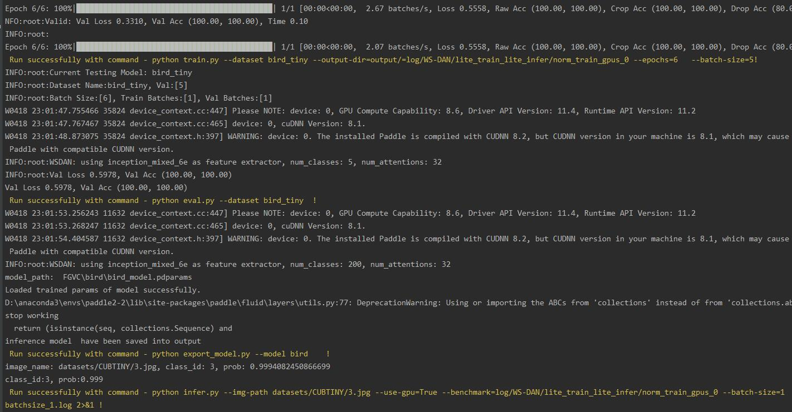

# Linux端基础训练推理功能测试

Linux端基础训练推理功能测试的主程序为`test_train_inference_python.sh`，可以测试基于Python的模型训练、评估、推理等基本功能，包括裁剪、量化、蒸馏。

## 1. 测试结论汇总

- 训练相关：

| 算法名称 | 模型名称 | 单机单卡 | 单机多卡 | 多机多卡 | 模型压缩（单机多卡） |
| :------: | :------: | :------: | :------: | :------: | :------------------: |
|  WS-DAN  |  WS-DAN  | 正常训练 |    -     |    -     |          -           |


- 推理相关：基于训练是否使用量化，可以将训练产出的模型可以分为`正常模型`和`量化模型`，这两类模型对应的推理功能汇总如下，

| 算法名称 | 模型名称 | 模型类型 | device | batchsize | tensorrt | mkldnn | cpu多线程 |
| :------: | :------: | -------- | :----: | :-------: | :------: | :----: | :-------: |
|  WS-DAN  |  WS-DAN  | 正常模型 |  GPU   |     1     |    -     |   -    |     -     |


## 2. 测试流程

### 2.1 准备数据

少量数据在datasets/CUBTINY下，包含5种不同的鸟类图片(原数据集有100种)。

### 2.2 准备环境


- 安装PaddlePaddle >= 2.2
- 安装AutoLog（规范化日志输出工具）
    ```
    pip install git+https://hub.fastgit.org/LDOUBLEV/AutoLog
    ```

### 2.3 功能测试


测试方法如下所示，希望测试不同的模型文件，只需更换为自己的参数配置文件，即可完成对应模型的测试。

```bash
bash test_tipc/test_train_inference_python.sh ${your_params_file} lite_train_whole_infer
```

以WS-DAN的`Linux GPU/CPU 基础训练推理测试`为例，命令如下所示。

```bash
bash test_tipc/test_train_inference_python.sh test_tipc/configs/WS-DAN/train_infer_python.txt  lite_train_lite_infer
```

log中输出结果如下，表示命令运行成功。

```
Run successfully with command - python train.py --dataset bird_tiny --output-dir=output/=log/WS-DAN/lite_train_lite_infer/norm_train_gpus_0 --epochs=6   --batch-size=5!
Run successfully with command - python eval.py --dataset bird_tiny  !
Run successfully with command - python export_model.py --model bird    ! 
Run successfully with command - python infer.py --img-path datasets/CUBTINY/3.jpg --use-gpu=True --benchmark=log/WS-DAN/lite_train_lite_infer/norm_train_gpus_0 --batch-size=1     > log/WS-DAN/lite_train_lite_infer/python_infer_gpu_batchsize_1.log 2>&1 !
```
TIPC结果：

<div align="center">
    
</div>

## 3. 更多教程

本文档为功能测试用，更丰富的训练预测使用教程请参考：  

* [模型训练、预测、推理教程](../../README.md)  